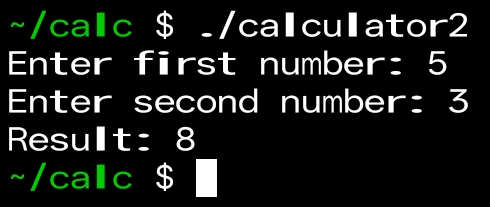

# ARM64 Calculator

A **fully working calculator** for Termux (ARM64) using **C with inline assembly**.

## Features
- Prompts user for two numbers
- Adds them using ARM64 assembly
- Prints the result
- Works directly on Termux (Android)

## How to run on Termux
1. Open Termux  
2. Install clang: `pkg install clang`  
3. Copy `calculator.c` from this repo  
4. Compile: `clang calculator.c -o calculator`  
5. Run: `./calculator`

## Demo
Enter first number: 5 Enter second number: 3 Result: 8

## Demo Screenshot

